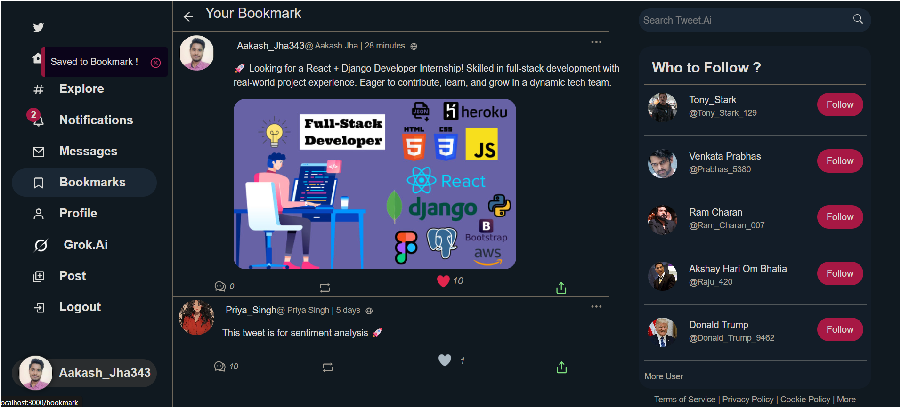

# 🦚 Tweet.Ai — AI-Powered Social Media Platform Inspired by Twitter, WhatsApp & Grok.Ai

A feature-rich, full-stack social media platform that lets users post, comment, chat, and interact — enhanced by powerful AI tools like **sentiment analysis** of comments, **summarization** of tweet & comments, and a built-in **chatbot**. It also supports **real-time private messaging with typing indicators**, providing a chat experience similar to modern messengers (like WhatsApp) and many more features.

Tweet.Ai blends the familiarity of Twitter with the conversational power of Grok.Ai and the real-time feel of WhatsApp to create a smarter, more meaningful online experience.

---

## 🚀 Features

### 📱 Core Social Features

- 🏠 **Home Feed**: View posts from users you follow.
- 🚀 **Explore Page**: Discover trending posts and users.
- 🔖 **Bookmarks**: Save favorite posts for quick access.
- 💬 **Nested Comments**: Engage in deep threaded discussions.
- 🤝 **Recommended Users**: Get intelligent suggestions of people to follow
- 👤 **Profile Management**: View followers, followings, and user posts.
- 🔎 **Search Users**: Easily find and follow other users.
- 🚫 **404 Page**: Custom page for broken links or invalid URLs.

### 💬 Communication

- 📩 **Private Messaging**: Real-time private chats with other users.
- ✍️ **Typing Indicator in DMs**: See when the other user is typing... — just like in WhatsApp.
- 🔔 **Notifications**: Get notified for likes, comments, follows, retweet and messages.
- 🤖 **Grok AI Chat**: Interact with a built-in AI chatbot: Grok.Ai

### 🧠 AI Features

- 📊 **Sentiment Analysis**: Analyze tweet/comment sentiment (Positive, Neutral, Negative).
- 🧹 **Filtered Comments**: View comments grouped by sentiment.
- ✍️ **Summarization**: Generate short summaries of long tweets and comment threads.
- 📈 **Comment Analysis**: Visual representation of comment sentiments.

### ⚙️ Admin & Developer Tools

- 🛠️ **Admin Panel**: Manage users, posts, comments, and reports via Django Admin.
- 🔄 **Pagination Support**: Efficient backend pagination for tweets, comments, and lists.
- 📘 **OpenAPI-Swagger UI**: Auto-generated API documentation for testing endpoints.
- 🧪 **Postman Collection**: Pre-built collection for testing all core APIs.

---

## 🛠️ Technical Stack

| Area            | Technologies                              |
|-----------------|-------------------------------------------|
| Frontend        | React.js⚛️                   
| Backend         | Django, Django Rest Framework🐍        |
| Database        | SQL 📊                                 |
| Realtime Chat   | Django Channels, WebSockets & Redis🔥  |
| AI Integration  | Gemini API🤖                           |
| Authentication  | JWT (JSON Web Token)🔏                 |
| API & Testing   | OpenAPI-Swagger & Postman🚀        |

---

## 🧭 Table of Contents

1. [📐 Entity Relationship Diagram (ERD)](#-1-entity-relationship-diagram-erd)
2. [🔌 Backend API Endpoints 👽🚀](#-2-backend-api-endpoints-)
3. [🛡️ Admin Panel 😎](#-3-admin-panel-)
4. [🖼️ Project Interface Screenshots](#-4-project-interface-screenshots)
   - [🏠 Home & Exploration](#-home--exploration)
   - [👤 Profile & Network](#-profile--network)
   - [📌 Posts & Engagement](#-posts--engagement)
   - [🔔 Notifications](#-notifications)
   - [💬 Real-time: Private & AI Chat](#-real-time--private--ai-chat)
   - [🧠 AI-Powered Sentiment Analysis🐦‍🔥🔥](#-ai-powered-sentiment-analysis)
   - [📝 AI-Powered Summarization🐦‍🔥🔥](#-ai-powered-summarization)
   - [🚫 Error Handling](#-error-handling)
5. [🔮 Future Enhancements](#-future-enhancements)
6. [🧑🏻‍💻 How to Run this project](#-clone--run-the-project)
7. [🙏🏻 Thank You](#-thank-you)

---

## 📐 1) Entity Relationship Diagram (ERD)

The project is backed by a well-structured relational data model that captures key entities like Users, Posts, Comments, Bookmarks, ChatRooms, Messages, and more. It ensures efficient data flow, indexing, and scalability.

📁 `Technical_Details/ER_diagram`

- 
- 

---

## 🔌 2) Backend API Endpoints 👽🚀

All core functionalities are supported by RESTful APIs developed using Django REST Framework. These APIs cover:

📁 `Technical_Details/Backend_APIs`

- 
- 

---

## 🛡️ 3) Admin Panel 😎

The admin panel offers full control over all models via Django's admin interface. Custom dashboards make it easy to manage:

📁 `Technical_Details/Admin_Panel`

- 

---

## 🖼️ 4) Project Interface Screenshots

Below is a complete visual walkthrough of Tweet.Ai’s user interface, organized into meaningful feature categories:

---

### 🏠 Home & Exploration

- **Home Feed**
  

- **Explore Page**
  

- **Recommended Users**
  

---

### 👤 Profile & Network

- **User Profile**
  

- **Followers List**
  

- **Following List**
  

- **User Search**
  

---

### 📌 Posts & Engagement

- **Bookmarking a Post**
  

- **Summarize Comment by Ai 🤖**
  

- **Comments under a Post**
  

- **Nested Comments**
  

---

### 🔔 Notifications

- **Real-time Notifications**
  

---

### 💬 Real time : Private & AI Chat

- **Private Chat Messaging with users**
  

- **Grok AI (Chat Interface)**
  .png)

- **Grok AI (Landing View)**
  

---

### 🧠 AI-Powered Sentiment Analysis🐦‍🔥🔥

- **Overall Sentiment Result**
  .png)

- **Filtered Comments by Sentiment🤩**
  - Positive😂  
    .png)
  - Neutral🙂  
    .png)
  - Negative😡  
    .png)

---

### 📝 AI-Powered Summarization🐦‍🔥🔥

- **Summarize any Tweet by Ai🤖**
  

- **Summarize any Comment by Ai🤖**
  

---

### 🚫 Error Handling

- **404 Page Not Found🙃**
  

---
## 🧑🏻‍💻 Clone & Run the project

###  1. Clone the Repository
```bash
git clone https://github.com/Aakash-Jha3903/Tweet.Ai.git
```

### 2. Navigate to the Server Directory
```bash
cd server
python -m venv venv
source venv/bin/activate   # On Windows: venv\Scripts\activate
```

###  3. Install Dependencies
```bash
#This may time to complete, due to the size of the dependencies and speed of your internet connection.
pip install -r requirements.txt
pip install -q -U google-genai  
```
### 4. Set Up Environment Variables
Create a `.env` file in the `server` and `client` directory and add the following variables:
#### 📁 `client/.env`
```env
REACT_APP_DOMAIN=http://localhost:8000/
REACT_APP_WS_DOMAIN=ws://localhost:8000/
```
#### 📁 `server/.env`
```env
SECRET_KEY="your_secret_key"

LLM_API_KEY=xyz    # Your Gemini/LLM API key (no spaces)
# 🤖 https://ai.google.dev/gemini-api/docs/quickstart

EMAIL_HOST_USER="your_gmail"
EMAIL_HOST_PASSWORD="your_gmail_password"
```
### 5. Run Migrations
```bash
python manage.py makemigrations
python manage.py migrate
```
### 6. Create a Superuser (Admin)
```bash
python manage.py createsuperuser
```
### 7. Run the Development Server
```bash
python manage.py runserver
```
### 8. Start the React Client
Open a new terminal, navigate to the `client` directory, and run:
```bash
cd client
npm install  #This may time to complete, due to the size of the dependencies and speed of your internet connection.
npm start
```
### 9. Access the Application
- Open your browser and go to `http://localhost:3000` to access the client
- For the admin panel, go to `http://localhost:8000/admin` and log in with the superuser credentials you created.

### 10 🗂️ Add .gitignore
- ⚠️ Make sure to include `.env` , node-modules and virtual environment folders in your `.gitignore` to avoid exposing secrets.

---

## 🙏🏻 Thank You

If you liked my project or found it useful:

- ⭐️ **Star the repo** – It motivates open‑source developers like me. 🙂
- 🍴 **Fork it** – Build and extend your own version. 🧑🏻‍💻
- 🧠 **Suggest Ideas** – Submit issues or feature requests. 
- 💬 **Feedback** – I love to hear your thoughts or suggestions.

---

- Made with ❤️ by Aakash Jha
- Connect on [LinkedIn](https://www.linkedin.com/in/aakash-jha-a11931257/)
- GitHub: [Aakash Jha](https://github.com/Aakash-Jha3903)
- Gmail: [aakashjha343@gmail.com](mailto:aakashjha343@gmail.com)
